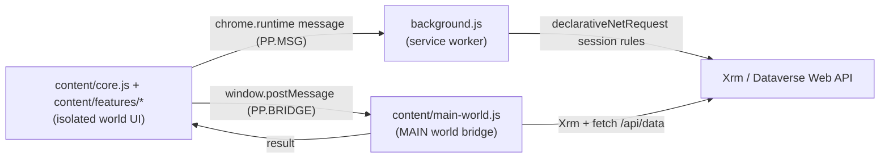

# Dynamics 365 Power Pane Next

[](https://github.com/Musecanyang/dynamics-365-power-pane-next/releases)
[](https://developer.chrome.com/docs/extensions/develop/migrate/what-is-mv3)
[](LICENSE)
[](https://github.com/Musecanyang/dynamics-365-power-pane-next/actions/workflows/ci.yml)

An in-page action pane, diagnostics toolkit and **real user impersonation** for
Microsoft Dynamics 365 / Dataverse, delivered as a single Manifest V3 browser
extension for Chrome and Edge.

It gives developers, testers and power users a fast set of quick actions right
inside the model-driven app — copy record ids/URLs, inspect fields and metadata,
flip debugging switches, edit a user's roles/teams/business unit, and perform
**server-side impersonation** without switching accounts.

> Not affiliated with, endorsed by, or supported by Microsoft. Built for
> development, testing and administration on non-production environments.

---

## Highlights

- **In-page pane** rendered in a Shadow DOM (host page styles can never leak in),
  opened from a compact button injected into the app navigation bar.
- **Real impersonation** via the Dataverse `CallerObjectId` request header
  (`declarativeNetRequest`), scoped so the impersonated identity survives SPA
  navigation, Advanced Find windows and reloads.
- **User Permissions editor** — view and modify a user's business unit, security
  roles and teams without leaving the app.
- **Entity/field tooling** — field inspector, all-fields dump, option set values,
  metadata browser, table processes.
- **Debug switches** — Microsoft's documented form troubleshooting URL flags
  (form monitor, command checker, disable handlers/libraries/command bar/BPF…).
- **Configurable** — reorder (drag), toggle and bind shortcuts to any action.
- **Zero build step** — plain, dependency-free JavaScript; load the folder and go.

---

## Features

Actions are grouped in the pane exactly as listed here.

### General
| Action | What it does |
| --- | --- |
| `User Info` | Current user's name, id and security roles / teams. |
| `Form Context` | Client URL, entity, record id, **form name/id** and form type (code + meaning). |
| `Run Code` | A Language selector (**JavaScript** / **FetchXML**) plus a source textarea. Pasted content auto-routes: text starting with an XML tag always executes as FetchXML (even when JavaScript is selected), and pasting an XML query switches the selector automatically. JavaScript runs in the page world with `xrm` in scope (top-level `await` / `return` work); FetchXML executes through the Organization service and renders a results table (formatted values, hover tooltips, click-to-copy first column, Copy JSON); failures show the platform's actual OData error message. The result dialog offers **Save to Snippets**. |
| `Snippets (FetchXML/JS)` | Snippet library stored in `chrome.storage.local` (device-local): create / edit / delete named snippets with a **Type** field (JavaScript or FetchXML), run them right from the list, and back the library up as JSON (Import merges, skipping exact duplicates). |

### Impersonation
| Action | What it does |
| --- | --- |
| `Impersonate User` | Search users by name/email/domain, then impersonate. Recent + pinned users are remembered. |
| `Stop Impersonation` | Clears the impersonation rules and reloads. |
| `DNR Rules (debug)` | Shows the active `declarativeNetRequest` session rules and cached state. |

### Record
| Action | What it does |
| --- | --- |
| `Entity Info` | Entity logical name and object type code. |
| `Record Id` / `Record Url` | Copy the record GUID / direct URL (including the current app id). |
| `Clone Record` | Opens a create form pre-filled from the current record. |
| `Record Properties` | Opens the record properties dialog. |
| `Field Inspector` | Table of every form control: label, schema name, type, value, required, visibility. Click a schema name to copy. |
| `Lookups` | Every lookup on the form with its target record; open in a new tab. |

### Form
| Action | What it does |
| --- | --- |
| `Enable All Fields` / `God Mode` | Make fields editable; God Mode also unhides everything and clears required levels. |
| `Show Hidden Fields` / `Disable Field Requirement` | Granular visibility / required-level changes. |
| `Logical Names (inline, click to copy)` | Appends `[schema_name]` to labels; click a label to copy the schema name. |
| `Clear Logical Names` | Restores the original labels. |
| `OptionSet Values` | Lists every option set of the entity with label + numeric value (searchable, grouped by field). |
| `Show Field Value` | Inspects a field's value (standard / option set / lookup). |
| `Find Field in Form` | Focuses and highlights a field by schema name. |
| `Highlight Dirty Fields` / `Changed Fields` | Highlights modified fields. |
| `Clear All Notifications` | Clears field-level notifications. |
| `Toggle Lookup Links` | Adds an "open in new window" link next to lookups. |
| `Refresh Ribbon` / `Refresh Form` / `Refresh Subgrids` | Refresh commands, the form, or all subgrids. |
| `Refresh Without Save` | Refreshes and disables auto-save for the session. |
| `All Fields` | One row per field: display name, logical name, type, target entity (for lookups), raw value and formatted value. Platform companion columns (`*name` / `*yominame`) are hidden, and the raw Web API JSON can be copied in one click. |
| `Table Processes` | Workflows, business rules, BPFs, actions and custom APIs for the entity; row detail + open. |

### Navigation
| Action | What it does |
| --- | --- |
| `Go to Record by Id` / `Go to Create Form` | Open a record / create form for any entity (entity picker with search). |
| `Open Web API Record` | Opens the record's Dataverse Web API URL. |
| `Entity Metadata Browser` | Attribute list (logical name, type, custom flag, required level). |
| `Entity Editor (Classic)` / `Form Editor (Classic)` / `Form Editor (New)` | Open the classic or the Power Apps maker editors. |
| `Open Entity List` / `System Jobs` / `Processes` / `Mailboxes` | Jump to common entity lists. |
| `Home` / `Open Advanced Find` | Navigate to the app home / advanced find. |
| `Security (Admin)` / `Solutions History` / `Advanced Settings - Users` | Admin portals and classic area (auto-navigates to Security → Users). |
| `Pin to Side Panel` | Pins the current page to the app side panel. |

### Debug
Microsoft's documented model-driven app troubleshooting URL flags, applied and
reloaded by the extension.

**Developer debug switch**: swallowed network failures inside the UI are
logged via `PPUtil.debugLog` - run `localStorage.setItem("__ppNextDebug", "1")`
once in the Dynamics page (or on the options page) and a console `debug` line
appears for every silently degraded call (metadata load, searches,
impersonation status).

| Action | URL parameter |
| --- | --- |
| `Forms Monitor` | `monitor=true` |
| `Command Checker` | `ribbondebug=true` |
| `Perf Center (URL)` | `perf=true` |
| `Disable Form Handlers` | `flags=DisableFormHandlers=true` |
| `Disable Business Rules` | `flags=DisableFormHandlers=businessrule` |
| `Disable Form Libraries` | `flags=DisableFormLibraries=true` |
| `Disable Form Command Bar` | `flags=DisableFormCommandbar=true` |
| `Disable Web Resource Controls` | `flags=DisableWebResourceControls=true` |
| `Disable Business Process Flow` | `flags=DisableBusinessProcessFlow=true` |
| `Disable Form Control` | `flags=DisableFormControl=<schema name>` |
| `Disable All Components (combined)` | `flags=DisableFormHandlers=true,DisableWebResourceControls=true,DisableFormCommandbar=true,DisableBusinessProcessFlow=true` |
| `Navbar Off` | `navbar=off` |
| `Enable Dark Mode (flag)` | `flags=themeoption=darkmode` |
| `Clear Flags` | removes the `flags` parameter |

### Admin
| Action | What it does |
| --- | --- |
| `Environment Info` | Org unique name/id, environment id, geo, version, language, on-premise flag. |
| `Organization Settings` | Base currency, default country, auto-save, language. |
| `Client Info` | Client type, theme, version, language, user agent. |
| `User Permissions (view/edit)` | Search a user and view/edit **Business Unit, Roles and Teams** inline. Changes are staged and applied on Save. The role picker lists the roles **of the user's own business unit** (Dataverse refuses cross-business-unit role assignments with HTTP 400) and every write failure surfaces the platform's real error message, not just the status code. |
| `Role Check` | Batch lookup: one or many names/emails → a table of Name, Email, Business Unit, Roles, Teams (copy/CSV export). |

---

## How it works

The extension has two in-page halves plus a service worker:



- **`content/core.js`** builds the pane in a Shadow DOM, reads/writes
  preferences, owns the shared UI primitives (modals, result renderers,
  action bar, input dialog) and exports the feature-module surface
  `window.PPPane`; **`content/boot.js`** calls `PPPane.boot()` after all
  feature modules have loaded.
- **`content/features/*.js`** are the self-contained feature editors
  (`impersonation`, `user-access` = User Permissions, `snippets` = FetchXML/JS
  library). They register their local actions and mount hooks with the core
  and share `state` / helpers only through the explicit `PPPane` surface.
- **`content/main-world.js`** is the MAIN-world entry: Xrm / Web API plumbing
  (`webApiGet` family, URL helpers, the SOAP parser) plus the command
  registry, frozen as `window.PPMain`. **`content/commands/*.js`** hold the
  command handlers grouped like `src/actions.js` groups (`general`, `runcode`,
  `records`, `forms`, `navigation`, `security`, `debug`) and register each one
  via `PPmain.register`; cross-command reads go through `PPmain.get`. Every
  handler answers with a small data table (`message`, `output`, `table`,
  `users`, `items`).
- **`background.js`** owns impersonation: it adds the `CallerObjectId` header to
  the environment's requests with `declarativeNetRequest` session rules.
- **`src/constants.js`** is the single source of truth for storage keys, message
  types and the product name; **`src/util.js`** holds the pure helpers shared
  by the content script and the options page; **`src/actions.js`** is the
  action registry.

### Impersonation

Impersonation uses the Dataverse **`CallerObjectId`** request header (set to the
target user's Microsoft Entra ID object id, taken from
`systemuser.azureactivedirectoryobjectid`). The legacy `MSCRMCallerID`
(systemuserid) header is set as well. See Microsoft's documentation:
[Impersonate another user using the Web API](https://learn.microsoft.com/en-us/power-apps/developer/data-platform/webapi/impersonate-another-user-web-api).

Requirements and behaviour:

- The signed-in account needs the **`prvActOnBehalfOfAnotherUser`** privilege
  (the Delegate / System Administrator role includes it).
- Impersonation is **server-side**: requests are executed as the target user, and
  the effective privileges are the intersection of both users' privileges. It
  does **not** change the browser sign-in, so UI chrome that reads the
  authenticated account (for example some Advanced Find surfaces) keeps showing
  the original user.
- Rules are scoped three ways — host-wide, service-worker requests
  (`tabIds: [-1]`) and the originating tab — so the impersonated identity
  survives SPA navigation, Advanced Find windows and inline reloads.
- Toggling impersonation clears the D365 client's cached identity key and forces
  a cache-bypassing reload so the new identity is used immediately.

---

## Installation

### Load unpacked (development)

1. Clone or download this repository.
2. Open `chrome://extensions` (Chrome) or `edge://extensions` (Edge).
3. Enable **Developer mode**.
4. Click **Load unpacked** and select the repository folder.
5. Open a Dynamics 365 / model-driven app and look for the Power Pane button in
   the navigation bar (or use the toolbar icon / <kbd>Alt</kbd>+<kbd>P</kbd>).

There is **no build step** — the source you load is the source you edit.

---

## Usage

- Click the navigation-bar button (or <kbd>Alt</kbd>+<kbd>P</kbd>) to open the pane.
- Use the search box to filter actions; <kbd>↑</kbd>/<kbd>↓</kbd> and
  <kbd>Enter</kbd> navigate and run.
- The pane closes when you run an action, click outside, move the pointer away,
  or press <kbd>Esc</kbd>.
- **Impersonate:** `Impersonation → Impersonate User`, search by name/email,
  click a result. Recent users are kept; the star pins a user.
- **User Permissions:** `Admin → User Permissions (view/edit)`, search a user,
  then edit Business Unit / Roles / Teams and click **Save**.
- **Diagnostics:** `Debug → …` picks a Microsoft troubleshooting flag.
- Popups have **Pin** (stay open) and **Pop** (float, draggable, page stays usable).

### Options & shortcuts

Open the options page from the pane's ⚙ button or the extension's options:

- toggle any action on/off (hidden ones sink to the bottom),
- drag to reorder within a group,
- record a keyboard shortcut per action (press <kbd>Backspace</kbd> while
  recording to clear),
- choose theme, reset the pane position, or restore all defaults.

---

## Permissions & privacy

| Permission | Why it is needed |
| --- | --- |
| `storage` | Persist preferences, snippets and impersonation state. |
| `tabs` | Detect new/updated tabs on an impersonated environment. |
| `declarativeNetRequestWithHostAccess` | Add the `CallerObjectId` header to the environment's Web API requests. |
| `https://*.dynamics.com/*` | Run the pane and bridge only on Dynamics 365 / Dataverse hosts. |

The extension has **no analytics, no telemetry and no backend**. It reuses the
browser's existing authenticated session; it never reads or stores credentials,
cookies or tokens.

---

## Project structure

```
manifest.json                 MV3 manifest (content scripts, background, options)
background.js                 service worker: toolbar toggle + impersonation (DNR)
src/
  constants.js                shared constants (name, storage keys, message types)
  util.js                     pure helpers shared by the content script + options
  actions.js                  action registry (the single source of truth)
content/
  core.js                     isolated-world pane: Shadow DOM UI, prefs, modals,
                              result renderers, bridge plumbing, PPPane surface
  features/
    impersonation.js          user search, real impersonation, DNR debug dialog
    user-access.js            User Permissions editor (roles / teams / BU / copy)
    snippets.js               FetchXML / JS snippet library
  boot.js                     calls PPPane.boot() after all modules have loaded
  main-world.js               MAIN-world entry: Xrm / Web API plumbing + the
                              command registry (frozen as window.PPMain)
  commands/
    general.js                diagnostics / context handlers
    runcode.js                FetchXML execute + JavaScript snippet runner
    records.js                record-centric handlers (ids / urls / properties)
    forms.js                  form editing handlers (fields / logical names ...)
    navigation.js             "open / go to" URL navigation handlers
    security.js               user access + role / team / business-unit writes
    debug.js                  Microsoft URL-flag + DNR debug handlers
scripts/                      Node guardrails (syntax + bridge-marker checks)
tests/                        unit tests (shared pure helpers, SOAP parser)
options/
  options.html, options.js    visibility / order / shortcuts / theme
icons/                        toolbar icons
```

### Adding an action

1. Add a handler in the matching `content/commands/<domain>.js` file, register
   it with `PPmain.register("<command>", function (...) { return ... })`,
   returning `{ message }`, `{ output }`, `{ table }` (or `{ users }` /
   `{ items }`).
2. Register it in `src/actions.js` with a stable `id`, `group`, `label` and
   `command`. Use `local: true` for actions handled in a feature module
   (`content/features/*.js`, via `PPPane.registerLocal`) instead.
3. (Optional) add inputs via the `inputs` array — `entity: true` gives an entity
   search field, `defaultCurrent: true` pre-fills the current entity.

Keep action `id`s stable: they are the keys used for saved visibility, order and
shortcuts.

---

## Compatibility

- Chrome / Edge, Manifest V3, Chromium **111+** (`world: "MAIN"` content scripts).
- Any Microsoft Dataverse environment reachable at `*.dynamics.com`.

---

## Credits

- **Forked from** [`onurmenal/crm-power-pane`](https://github.com/onurmenal/crm-power-pane)
  (MIT, © 2018 Onur Menal) — the original Dynamics CRM Power Pane concept, UI
  layout and action set.
- **Inspired by / features referenced from**
  [`rajyraman/Levelup-for-Dynamics-CRM`](https://github.com/rajyraman/Levelup-for-Dynamics-CRM)
  (MIT, © 2016 Natraj Yegnaraman) — debugging actions, All Fields, Table
  Processes, user access tooling and impersonation.
- Impersonation and troubleshooting flags follow Microsoft's own documentation
  (see below).

## Microsoft documentation

- Impersonate another user (Web API): <https://learn.microsoft.com/en-us/power-apps/developer/data-platform/webapi/impersonate-another-user-web-api>
- Impersonate another user (overview): <https://learn.microsoft.com/en-us/power-apps/developer/data-platform/impersonate-another-user>
- Troubleshoot form issues / URL parameters & flags: <https://learn.microsoft.com/en-us/power-apps/developer/model-driven-apps/troubleshoot-forms>
- Live monitor for model-driven apps (`monitor=true`): <https://learn.microsoft.com/en-us/power-apps/maker/monitor-modelapps>
- Command Checker (`ribbondebug=true`): <https://www.microsoft.com/en-us/power-platform/blog/power-apps/introducing-command-checker-for-model-app-ribbons/>
- Client API — `formContext.ui.getFormType`: <https://learn.microsoft.com/en-us/power-apps/developer/model-driven-apps/clientapi/reference/formcontext-ui/getformtype>
- Client API — `Xrm.Utility.getGlobalContext`: <https://learn.microsoft.com/en-us/power-apps/developer/model-driven-apps/clientapi/reference/xrm-utility/getglobalcontext>
- Dataverse Web API overview: <https://learn.microsoft.com/en-us/power-apps/developer/data-platform/webapi/overview>
- Query metadata (EntityDefinitions / attributes): <https://learn.microsoft.com/en-us/power-apps/developer/data-platform/webapi/query-metadata-web-api>
- `team` entity (`teamtype`): <https://learn.microsoft.com/en-us/power-apps/developer/data-platform/reference/entities/team>
- Associate/disassociate records: <https://learn.microsoft.com/en-us/power-apps/developer/data-platform/webapi/associate-disassociate-entities-using-web-api>

---

## Disclaimer

This is an unsupported developer/administrator tool. Review it against your own
security and compliance requirements before use, and avoid using impersonation
or write operations on production data. The authors accept no liability for data
loss or unintended changes.

## License

[MIT](LICENSE) — see the `LICENSE` file. Portions are derived from the MIT
licensed projects credited above; their copyright notices are retained.
